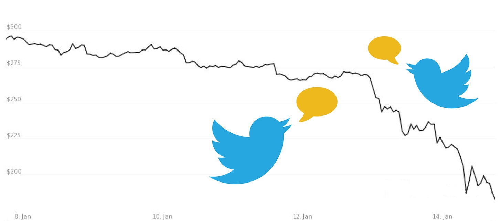

# CryptoCurrenciesSocialMedia
Project goal is to analyse influences of social media, in particular Tweeter, on Bitcoin rate, in the current time period (Q1 2019). Therefore, we will apply different machine learning methods and algorithms to identify common trends and make forecasts as accurate as possible.

## Approach
Our approach is to perform sentiment analysis on Tweets to classify them into positive/neutral/negative types.
Then correlate this to the bitcoin prices. Finally a prediction can be made using the resulting model.

